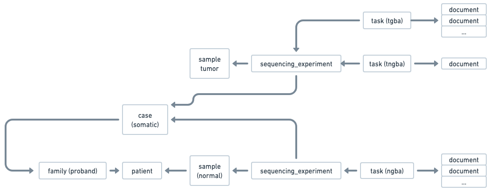
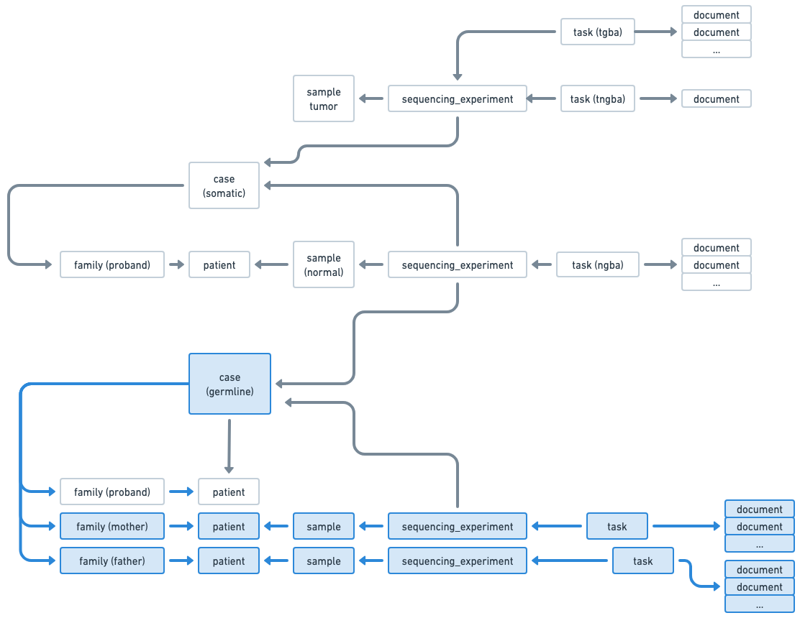

## Use case: Germline Case with an existing sequencing experiment from another case 

This use case demonstrates how to create a Germinal case using the Radiant API, with a sequencing experiment already existing for a member of the case. 


### Starting point  
You want to create a germinal case (family), and the proband sequencing experiment already exists in Radiant for another case. 

This is what already exists in Radiant : 


You don't need to create the patients again since they already exist in Radiant from the germline case.

### Step 1: Create patients
First, create patient for parents that will be part of the germinal case. Proband already exists in Radiant.

```
POST /patients/batch
{
  "patients": [
    {
      "is_alive": true,
      "organization_code": "CHOP", <-- organization code for the mother
      "organization_patient_id": "PA002", <-- organization code for the mother
      "organization_type_code": "mrn"
    },
    {
      "is_alive": true,
      "organization_code": "CHOP", <-- organization code for the father
      "organization_patient_id": "PA003", <-- organization code for the father
      "organization_type_code": "mrn"
    }    
  ]
}
```

### Step 2: Create samples
Then, create the samples that will be part of the germinal case. Proband sample already exists in Radiant.

```
POST /samples/batch
{
  "samples": [
    {
      "histology": "normal",
      "organization_code": "CHOP", <-- organization code for the mother
      "submitter_sample_id": "SA002", <-- external sample identifier for the mother
      "organization_patient_id": "PA002", <-- external patient identifier for the mother
      "sample_type": "dna",
      "tissue_site": "blood"
    },
    {
      "histology": "normal",
      "organization_code": "CHOP", <-- organization code for the father
      "submitter_sample_id": "SA003", <-- external sample identifier for the father
      "organization_patient_id": "PA003", <-- external patient identifier for the father
      "sample_type": "dna",
      "tissue_site": "blood"
    },    
  ]
} 
```

### Step 3: Create the germinal case
Now, create the germinal case and associate the patients and samples created in the previous steps.




```
POST /cases <-- you can also POST /cases/batch in case you have multiple cases. 

{
  "type": "germline",
  "status_code": "in_progress",
  "project_code": "CBTN",
  "diagnostic_lab_code": "DGL123",
  "panel_code": "LEUKEMIA",
  "primary_condition_mondo_code": "MONDO:0001234",  
  "request_priority_code": "routine",  
  "patients": [
    { // Proband case information
      "affected_status_code": "affected",
      "family_history": [...],
      "observations_categorical": [...],
      "observations_text": [...],
      "organization_patient_id": "PA001", <-- external patient identifier for the proband
      "organization_code": "CHOP", <-- organization code for the proband
      "relation_to_proband_code": "proband"
    },
    { // Mother case information
      "affected_status_code": "not_affected",
      "family_history": [...],
      "observations_categorical": [...],
      "observations_text": [...],
      "organization_code": "CHOP",
      "organization_patient_id": "PA002",
      "relation_to_proband_code": "mother"
    },        
    { // Father case information
      "affected_status_code": "not_affected",
      "family_history": [...],
      "observations_categorical": [...],
      "observations_text": [...],
      "organization_code": "CHOP",
      "organization_patient_id": "PA003",
      "relation_to_proband_code": "father"
    }     
  ],

  "sequencing_experiments": [
    { // Existing Normal Sequencing experiment for the proband, partially referenced
      "aliquot": "NORMAL_ALQ001",
      "sample_organization_code": "CHOP", <-- organization code for the proband
    },
    {  // Sequencing experiment for the mother
      "aliquot": "ALQ002",
      "sample_organization_code": "CHOP",
      "submitter_sample_id": "SA002",
      "capture_kit": "KAPA",
      "experiment_code": "...",
      "is_paired_end": true,
      "performer_lab_code": "LAB001",
      "read_length": 100,
      "request_priority_code": "routine",
      "run_alias": "run_123",
      "run_date": "2020-09-19T14:00:00Z",
      "run_name": "Run 123",
      "status_code": "completed",
      "task": {
        "pipeline_code": "...",
        "type": "nga",
        "documents": [
          {
            "data_category_code": "genomic",
            "data_type_code": "alignment",
            "format_code": "cram",
            "hash": "9e107d9d372bb6826bd81d3542a419d6",
            "name": "FILE002.cram",
            "size": 123456,
            "url": "s3://bucket/prefix/FILE002.cram"
          },
          ....
        ]
      }
    },
    {  // Sequencing experiment for the father
      "aliquot": "ALQ003",
      "sample_organization_code": "CHOP",
      "submitter_sample_id": "SA003",
      "capture_kit": "KAPA",
      "experiment_code": "...",
      "is_paired_end": true,
      "performer_lab_code": "LAB001",
      "read_length": 100,
      "request_priority_code": "routine",
      "run_alias": "run_456",
      "run_date": "2020-10-05T14:00:00Z",
      "run_name": "Run 456",
      "status_code": "completed",
      "task": {
        "pipeline_code": "...",
        "type": "nga"
        "documents": [
          {
            "data_category_code": "genomic",
            "data_type_code": "alignment",
            "format_code": "cram",
            "hash": "9e107d9d372bb6826bd81d3542a419d6",
            "name": "FILE003.cram",
            "size": 123456,
            "url": "s3://bucket/prefix/FILE003.cram"
          },
          ....
        ]
      }
    }                 
        
        
                
  ],

}
```


