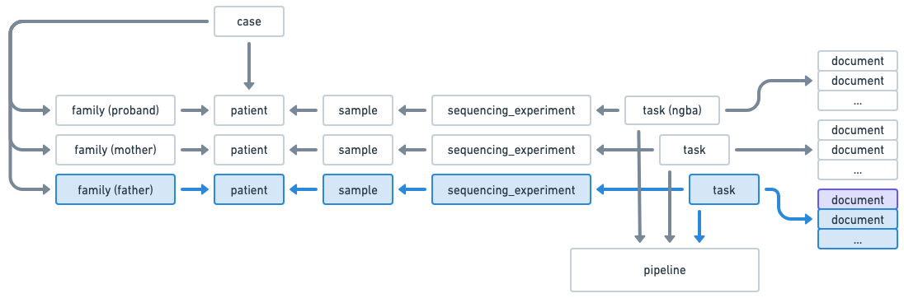

## Use case: Create a Germline family case 

This use case demonstrates how to create a Germline family case using the Radiant API. 
It includes creating a case, adding samples, and associating them with family members.

### Starting point  
You want to create a Germline family case with a proband and only one parent (mother). 
The information about the father is not yet available.

This is what you know at this point:


### Step 1: Create the patients
First, create the patients that will be part of the family case.
```
POST /patients/batch
{
  "patients": [
    {
      "is_alive": true,
      "organization_code": "CHOP", <-- organization code for the proband
      "organization_patient_id": "PA001", <-- organization code for the proband
      "organization_type_code": "mrn"
    },
    {
      "is_alive": true,
      "organization_code": "CHOP",
      "organization_patient_id": "PA002",
      "organization_type_code": "mrn"
    }    
  ]
}
  
```

### Step 2: Create the samples
Then, create the samples that will be part of the family case.
```
POST /samples/batch
{
  "samples": [
    {
      "histology": "normal",
      "organization_code": "CHOP", <-- organization code for the proband
      "submitter_sample_id": "SA001", <-- external sample identifier for the proband
      "organization_patient_id": "PA001", <-- external patient identifier for the proband
      "parent_submitter_sample_id": "SP010", <-- parent external sample identifier (blood sample)
      "sample_type": "dna",
      "tissue_site": "blood"
    },
    {
      "histology": "normal",
      "organization_code": "CHOP",
      "organization_patient_id": "PA002",
      "sample_type": "dna",
      "submitter_sample_id": "SA002",
      "tissue_site": "blood"
    },    
    {
      "histology": "normal",
      "organization_code": "CHOP",
      "organization_patient_id": "PA001",
      "sample_type": "blood",
      "submitter_sample_id": "SP010",
      "tissue_site": "blood"
    },            
  ]
} 
```
In this specific example, we create three samples : 
- Two samples for the proband (SA001 and its parent SP010)
- One sample for the mother (SA002)

The goal is to illustrate the use of a parent-child relationship between samples.

### Step 3: Create the family case
Now, create the family case and associate the patients and samples created in the previous steps.
```
POST /cases <-- you can also POST /cases/batch in case you have multiple cases. 

{
  "type": "germline",
  "status_code": "in_progress",
  "project_code": "CBTN",
  "diagnostic_lab_code": "DGL123",
  "panel_code": "LEUKEMIA",
  "primary_condition_mondo_code": "MONDO:0001234",  
  "request_priority_code": "routine",  
  "patients": [
    {
      "affected_status_code": "affected",
      "family_history": [...],
      "observations_categorical": [...],
      "observations_text": [...],
      "organization_patient_id": "PA001", <-- external patient identifier for the proband
      "organization_code": "CHOP", <-- organization code for the proband
      "relation_to_proband_code": "proband"
    },
    {
      "affected_status_code": "not_affected",
      "family_history": [...],
      "observations_categorical": [...],
      "observations_text": [...],
      "organization_code": "CHOP",
      "organization_patient_id": "PA001",
      "relation_to_proband_code": "mother"
    }    
  ],

  "sequencing_experiments": [
    { // Sequencing experiment for the proband
      "aliquot": "ALQ001",
      "sample_organization_code": "CHOP", <-- organization code for the proband
      "submitter_sample_id": "SA001", <-- external sample identifier for the proband
      "capture_kit": "KAPA",
      "experiment_code": "...",
      "is_paired_end": true,
      "performer_lab_code": "LAB001",
      "read_length": 100,
      "request_priority_code": "routine",
      "run_alias": "run_123",
      "run_date": "2020-09-19T14:00:00Z",
      "run_name": "Run 123",
      "status_code": "completed",
      "task": {
        "type": "nga",
        "pipeline_code": "...",
        "documents": [
          {
            "data_category_code": "genomic",
            "data_type_code": "alignment",
            "format_code": "cram",
            "hash": "9e107d9d372bb6826bd81d3542a419d6",
            "name": "FILE001.cram",
            "size": 123456,
            "url": "s3://bucket/prefix/FILE001.cram"
          },
          ....
        ]
      }
    }
    {  // Sequencing experiment for the mother
      "aliquot": "ALQ002",
      "sample_organization_code": "CHOP",
      "submitter_sample_id": "SA002",
      "capture_kit": "KAPA",
      "experiment_code": "...",
      "is_paired_end": true,
      "performer_lab_code": "LAB001",
      "read_length": 100,
      "request_priority_code": "routine",
      "run_alias": "run_123",
      "run_date": "2020-09-19T14:00:00Z",
      "run_name": "Run 123",
      "status_code": "completed",
      "task": {
        "pipeline_code": "...",
        "type": "nga",
        "documents": [
          {
            "data_category_code": "genomic",
            "data_type_code": "alignment",
            "format_code": "cram",
            "hash": "9e107d9d372bb6826bd81d3542a419d6",
            "name": "FILE002.cram",
            "size": 123456,
            "url": "s3://bucket/prefix/FILE002.cram"
          },
          ....
        ]
      }
    }        
  ],

}
```


### Step 4: Add family members
Let say 2 weeks later, you have the information about the father, and you want to add him to the case.

This is what you know at this point:


You want to add blue elements in the diagram to the case.

Create the patient and the samples for the father
```
POST /patients/batch
{
  "patients": [
    {
      "is_alive": true,
      "organization_code": "CHOP",
      "organization_patient_id": "PA003",
      "organization_type_code": "mrn"
    },
}

POST /samples/batch
{
  "samples": [
    {
      "histology": "normal",
      "organization_code": "CHOP",
      "organization_patient_id": "PA003",
      "sample_type": "dna",
      "submitter_sample_id": "SA003",
      "tissue_site": "blood"
    }      
  ]
} 
```

Then add the father to the case. For that, you first need to retrieve the case_id using the portal or other endpoints (TBD).
Then use the PATCH /cases/{id} endpoint to add the father to the case.
```
PATCH /cases/123
{
  "patients": [
    {
      "affected_status_code": "not_affected",
      "family_history": [...],
      "observations_categorical": [...],
      "observations_text": [...],
      "organization_code": "CHOP",
      "organization_patient_id": "PA003",
      "relation_to_proband_code": "father"
    }       
  ],
  "primary_condition_mondo_code": "string",
  "sequencing_experiments": [
    {  // Sequencing experiment for the father
      "aliquot": "ALQ003",
      "sample_organization_code": "CHOP",
      "submitter_sample_id": "SA003",
      "capture_kit": "KAPA",
      "experiment_code": "...",
      "is_paired_end": true,
      "performer_lab_code": "LAB001",
      "read_length": 100,
      "request_priority_code": "routine",
      "run_alias": "run_456",
      "run_date": "2020-10-05T14:00:00Z",
      "run_name": "Run 456",
      "status_code": "completed",
      "task": {
        "pipeline_code": "...",
        "type": "nga"
        "documents": [
          {
            "data_category_code": "genomic",
            "data_type_code": "alignment",
            "format_code": "cram",
            "hash": "9e107d9d372bb6826bd81d3542a419d6",
            "name": "FILE003.cram",
            "size": 123456,
            "url": "s3://bucket/prefix/FILE003.cram"
          },
          ....
        ]
      }
    } 
  ],
}
```
