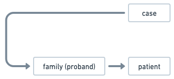
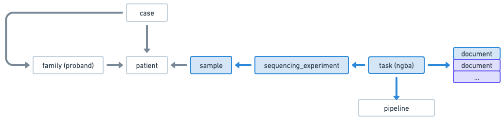

## Use case: Create a Germline solo case step by step

This use case demonstrates how to create a Germline case using the Radiant API.
It describes the steps to create a case with only patient information. And then how to update the case when sample information becomes available.

### Starting point
You want to create a Germline case with only information about the patient (proband).
The information about the samples and sequencing experiment are not yet available.

This is what you know at this point:




### Step 1: Create the patient
First, create the patient that will be part of the case.
```
POST /patients/batch
{
  "patients": [
    {
      "is_alive": true,
      "organization_code": "CHOP", <-- organization code for the proband
      "organization_patient_id": "PA001", <-- organization code for the proband
      "organization_type_code": "mrn"
    }
  ]
}
  
```

### Step 2: Create the case
Now, create the family case and associate the patient created in the previous steps.
```
POST /cases <-- you can also POST /cases/batch in case you have multiple cases. 

{
  "type": "germline",
  "status_code": "in_progress", <-- the status of the case is "in_progress" because we don't have all the information yet
  "project_code": "CBTN",
  "diagnostic_lab_code": "DGL123",
  "panel_code": "LEUKEMIA",
  "primary_condition_mondo_code": "MONDO:0001234",  
  "request_priority_code": "routine",  
  "patients": [
    {
      "affected_status_code": "affected",
      "family_history": [...],
      "observations_categorical": [...],
      "observations_text": [...],
      "organization_patient_id": "PA001", <-- external patient identifier for the proband
      "organization_code": "CHOP", <-- organization code for the proband
      "relation_to_proband_code": "proband"
    }
  ]

}
```

### Step 3: Add samples and sequencing experiment to the case
Let say 2 weeks later, you have the information about the samples and the sequencing experiment.

This is what you know at this point:


You want to add blue elements in the diagram to the case.

Create the samples 
```
POST /samples/batch
{
  "samples": [
    {
      "histology": "normal",
      "organization_code": "CHOP",
      "organization_patient_id": "PA001",
      "sample_type": "dna",
      "submitter_sample_id": "SA001",
      "tissue_site": "blood"
    }      
  ]
} 
```

Then add the sequencing experiment to the case. For that, you first need to retrieve the case_id using the portal or other endpoints (TBD).
Then use the PATCH /cases/{id} endpoint to add the sequencing experiment to the case. We will also update the status of the case to "complete" to indicate that all information is now available.
```
PATCH /cases/123
{
  "status_code": "complete", <-- update the status of the case to "complete"
  "sequencing_experiments": [
    {  // Sequencing experiment for the proband
      "aliquot": "ALQ001",
      "sample_organization_code": "CHOP",
      "submitter_sample_id": "SA001",
      "capture_kit": "KAPA",
      "experiment_code": "...",
      "is_paired_end": true,
      "performer_lab_code": "LAB001",
      "read_length": 100,
      "request_priority_code": "routine",
      "run_alias": "run_456",
      "run_date": "2020-10-05T14:00:00Z",
      "run_name": "Run 456",
      "status_code": "completed",
      "task": {
        "pipeline_code": "...",
        "type": "nga"
        "documents": [
          {
            "data_category_code": "genomic",
            "data_type_code": "alignment",
            "format_code": "cram",
            "hash": "9e107d9d372bb6826bd81d3542a419d6",
            "name": "FILE001.cram",
            "size": 123456,
            "url": "s3://bucket/prefix/FILE001.cram"
          },
          ....
        ]
      }
    } 
  ],
}
```
