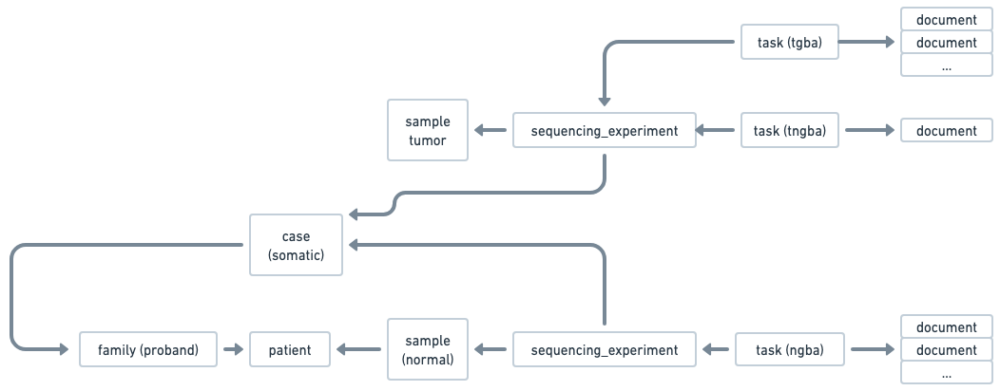

## Use case: Create a Somatic case 

This use case demonstrates how to create a Somatic case using the Radiant API, with an existing sequencing experiment for normal sample. 


### Starting point  
You want to create a somatic case, and the germline case already exists in Radiant. 

This is what already exists in Radiant :


You don't need to create the patients again since they already exist in Radiant from the germline case.
  

### Step 1: Create somatic sample
For sample creation, you only need to create the somatic sample for the proband.

```
POST /samples/batch
{
  "samples": [
    {
      "histology": "tumor",
      "organization_code": "CHOP", <-- organization code for the proband
      "submitter_sample_id": "SA001", <-- external sample identifier for the proband
      "organization_patient_id": "PA001", <-- external patient identifier for the proband
      "parent_submitter_sample_id": "SP010", <-- parent external sample identifier (blood sample)
      "sample_type": "dna",
      "tissue_site": "blood"
    },
    {
      "histology": "tumor",
      "organization_code": "CHOP",
      "organization_patient_id": "PA001",
      "sample_type": "blood",
      "submitter_sample_id": "SA010",
      "tissue_site": "blood"
    }            
  ]
} 
```

In this specific example, we create two samples for the proband (SA001 and its parent SP010).

The goal is to illustrate the use of a parent-child relationship between samples.

### Step 2: Create the somatic case

Now, create the somatic case and associate the patients and samples created in the previous steps.


```
POST /cases <-- you can also POST /cases/batch in case you have multiple cases. 

{
  "type": "somatic",
  "status_code": "in_progress",
  "project_code": "CBTN",
  "diagnostic_lab_code": "DGL123",
  "panel_code": "LEUKEMIA",
  "primary_condition_mondo_code": "MONDO:0001234",  
  "request_priority_code": "routine",  
  "patients": [
    {
      "affected_status_code": "affected",
      "family_history": [...],
      "observations_categorical": [...],
      "observations_text": [...],
      "organization_patient_id": "PA001", <-- external patient identifier for the proband
      "organization_code": "CHOP", <-- organization code for the proband
      "relation_to_proband_code": "proband"
    }
  ],

  "sequencing_experiments": [
    { // Existing Normal Sequencing experiment for the proband, partially referenced
      "aliquot": "NORMAL_ALQ002",
      "sample_organization_code": "CHOP", <-- organization code for the proband
    },
    { // Somatic Sequencing experiment for the proband
      "aliquot": "TUMOR_ALQ001",
      "capture_kit": "KAPA",
      "experiment_code": "...",
      "is_paired_end": true,
      "performer_lab_code": "LAB001",
      "read_length": 100,
      "request_priority_code": "routine",
      "run_alias": "run_123",
      "run_date": "2020-09-19T14:00:00Z",
      "run_name": "Run 123",
      "status_code": "completed",
      "task": { // Task for the tumor-only
        "type": "toga",
        "pipeline_code": "...",
        "documents": [
          {
            "data_category_code": "genomic",
            "data_type_code": "alignment",
            "format_code": "cram",
            "hash": "9e107d9d372bb6826bd81d3542a419d6",
            "name": "FILE001.cram",
            "size": 123456,
            "url": "s3://bucket/prefix/FILE001.cram"
          },
          ....
        ]
      },
      "task": { //Task for the tumor-normal
        "type": "tnga",
        "normal_aliquot": "NORMAL_ALQ002", <--- aliquot for the normal sample
        "normal_sample_organization_code": "CHOP", <--- organization code for the normal sample
        "pipeline_code": "...",
        "documents": [
          {
            "data_category_code": "genomic",
            "data_type_code": "alignment",
            "format_code": "cram",
            "hash": "9e107d9d372bb6826bd81d3542a419d6",
            "name": "FILE002.cram",
            "size": 123456,
            "url": "s3://bucket/prefix/FILE002.cram"
          },
          ....
        ]
      }      
    }
                
  ],

}
```


